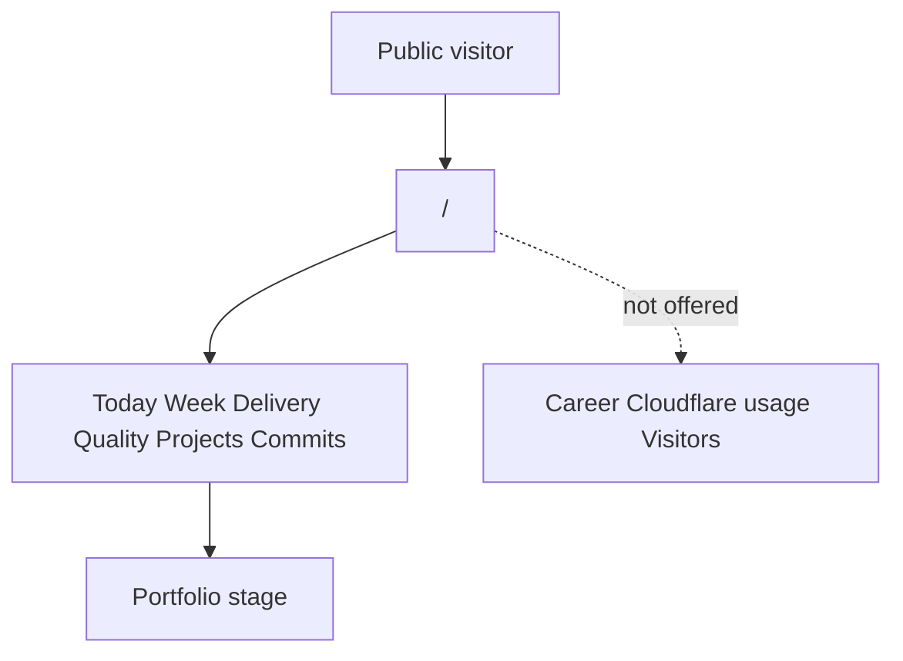
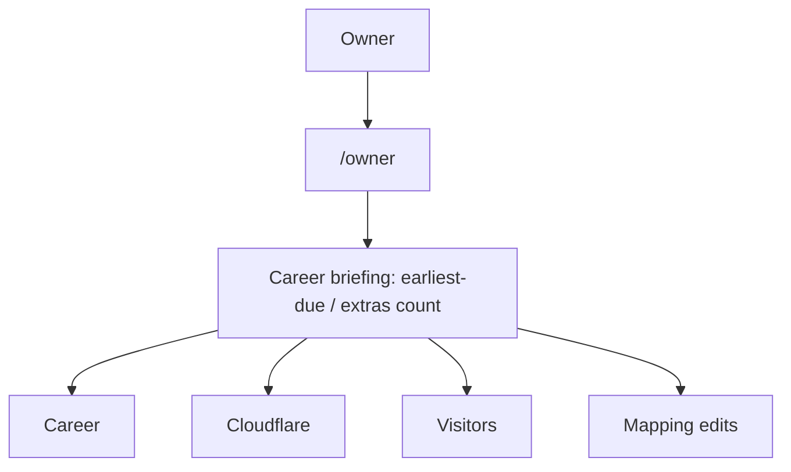
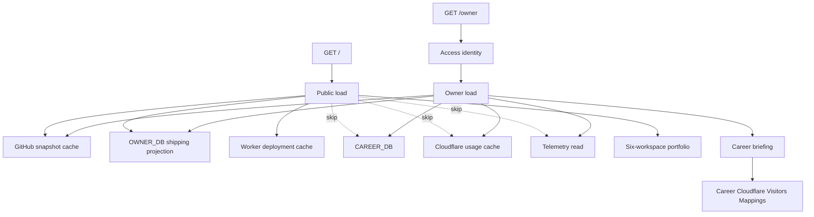

# Public and Owner Audience Split - Plan

## Goal Capsule

- **Objective:** Split Weeknote into a public engineering portfolio and a distinct Access-protected owner home, so strangers see daily shipping evidence while Career, Cloudflare usage, and visitor telemetry stay owner-only.
- **Product authority:** This plan owns the public vs owner audience split. Public visual restyling, disguising `/owner`, and changing the ShareDraft export are not active scope. `AGENTS.md` and `docs/standards/` own coding standards for touched files.
- **Stop conditions:** Stop if public `/` would still serialize Career, Cloudflare usage, or visitor telemetry, or if `/owner` still re-exports the public dashboard.
- **Execution profile:** Domain audience split first, then public load withholding, then separate owner page. Prove payload omission with tests before UI polish.
- **Tail ownership:** The implementer removes abandoned dual-dashboard branches. Do not leave a shared page with audience flags beside a new owner home.
- **Open blockers:** None.

---

## Product Contract

### Summary

Public Weeknote becomes an engineering portfolio of Today, Week, Delivery, Quality, Projects, and Commits, including confirmed Worker and domain shipping links.
`/owner` becomes its own Access-protected home: a Career briefing with doors into Career, Cloudflare, Visitors, and project-mapping edits.
Public responses omit Career records, Cloudflare usage, and visitor telemetry.

### Problem Frame

ADR 0009 published the complete dashboard, including Career records, Cloudflare account evidence, and visitor telemetry.
`/` and `/owner` currently render the same nine-workspace workbench.
Access only gates writes, so a stranger on `latham.cloud` can read job-search state, account usage, and visit analytics.
That crowding fights the public promise: show that the owner ships.

### Key Decisions

- KD1. Public surface is an engineering portfolio, not a daily-only strip or the current nine-tab dashboard. (session-settled: user-directed — chosen over daily-only and hide-named-tabs-only: strangers should leave knowing the owner is an engineer who ships.) Governs R1, R3.
- KD2. Private owner data is withheld from public responses, not merely hidden in the rail. (session-settled: user-directed — chosen over hide-tabs-only: inspecting the page must not reveal Career, Cloudflare usage, or visitor telemetry.) Governs R5, R6, R7.
- KD3. `/owner` is a distinct owner home, not the public dashboard plus extra tabs. (session-settled: user-directed — chosen over the smallest same-dashboard split: owner ops should feel like its own place.) Governs R10, R14.
- KD4. `/owner` lands on a Career briefing, then opens deeper owner areas. (session-settled: user-directed — chosen over a three-tab ops rail and a form-first back office: first paint is due work / next action.) Governs R11, R12.
- KD5. Public Projects may show confirmed Worker and domain links as portfolio evidence. (session-settled: user-directed — chosen over GitHub-only Projects and moving Projects to `/owner`: shipping links are public; the Cloudflare usage screen is not.) Governs R3, R6.
- KD6. Project-mapping edits live on `/owner` as their own area. (session-settled: user-directed — chosen over editing from Cloudflare, leaving mappings read-only, or opening public Projects in edit mode from `/owner`.) Governs R4, R13.
- KD7. `/career/portfolio.md` stays a public ShareDraft export. (session-settled: user-directed — chosen over Access-locking it or ignoring it: ShareDraft stories are meant to be shared.) Governs R16.
- KD8. The owner briefing's required pulse is Career due / next action only. (session-settled: user-directed — chosen over also requiring Cloudflare health, visit, mapping-gap, or GitHub-ops pulses on first paint.) Governs R11, R15.

### Actors

- A1. Public visitor — anyone on `/`, including the owner reviewing the portfolio.
- A2. Owner — the configured Access identity (`olen@latham.cloud`) on `/owner`.

### Requirements

**Public portfolio**

- R1. The public homepage presents Today, Week, Delivery, Quality, Projects, and Commits as the available workspaces.
- R2. Public navigation, shortcuts, and command palette cannot reach Career, Cloudflare usage, or Visitors.
- R3. Public Projects may show confirmed GitHub repository, Worker, and domain shipping links. It does not include D1, KV, R2, or the rest of the owner-project snapshot.
- R4. Public Projects is read-only: mapping create, update, and remove controls do not appear there. Public `/` reuses the existing Projects workspace without those forms; it does not add a second Projects component.

**Withheld owner data**

- R5. Public `/` responses omit Career records, including in payloads a visitor can inspect.
- R6. Public `/` responses omit Cloudflare usage, account-inventory evidence, and deferred usage-refresh keys. They may still include the shipping links allowed by R3.
- R7. Public `/` responses omit visitor telemetry views and aggregates. Public deployment evidence omits operator identity such as author email and who triggered the deploy.

**Owner home**

- R8. `/owner` remains protected by Cloudflare Access for the configured owner identity. A denied GET fails closed (forbidden) and does not serialize Career, usage, or telemetry.
- R9. Career, Cloudflare usage, visitor telemetry, and mapping mutations still require both the `/owner` path and that Access identity.
- R10. `/owner` presents a distinct owner home rather than the public portfolio chrome with extra tabs. Owner rail, shortcuts, and command palette use the owner workspace list only.
- R11. `/owner` lands on a Career briefing that shows the earliest-due follow-up as the primary pulse. Additional follow-ups appear as a count that opens Career, not as the full review.
- R12. From that briefing, the owner can open Career, Cloudflare, Visitors, and mapping-edit areas. Those four ids are both in-briefing doors and owner-rail items; the briefing itself is the default workspace.
- R13. GitHub ↔ Cloudflare mapping edits live on `/owner` as their own area, not on public Projects.
- R14. `/owner` is not the place to browse Today, Week, Delivery, Quality, Projects, or Commits; those remain on `/`.
- R15. Owner-only screens remain reachable after the briefing without requiring pulses other than R11. The owner can return to the briefing from any owner area without leaving `/owner`.

**Kept public export**

- R16. `/career/portfolio.md` remains publicly readable and still includes only ShareDraft stories.

### Key Flows

- F1. Public portfolio visit
  - **Trigger:** A1 opens `/`.
  - **Actors:** A1
  - **Steps:** The public rail offers the six portfolio workspaces. Career, Cloudflare usage, and Visitors are absent. Projects may show shipping links and no mapping editors.
  - **Outcome:** A1 can judge that the owner ships, without owner-ops data.
  - **Covered by:** R1, R2, R3, R4

- F2. Public inspect or guessed owner surface
  - **Trigger:** A1 inspects the public page or tries to open an owner workspace.
  - **Actors:** A1
  - **Steps:** Public navigation refuses the owner destinations. Public payloads omit Career records, Cloudflare usage, and visitor telemetry.
  - **Outcome:** Owner-ops data is not reachable from `/`.
  - **Covered by:** R2, R5, R6, R7

- F3. Owner briefing and drill-in
  - **Trigger:** A2 opens `/owner` with Access.
  - **Actors:** A2
  - **Steps:** `/owner` lands on the Career briefing. A2 opens Career, Cloudflare, Visitors, or mapping edits from there.
  - **Outcome:** A2 works private ops without using the public portfolio as the owner shell.
  - **Covered by:** R8, R10, R11, R12, R14, R15

- F4. Mapping edit
  - **Trigger:** A2 changes a GitHub ↔ Cloudflare mapping.
  - **Actors:** A2
  - **Steps:** A2 opens the mapping-edit area from the `/owner` briefing and submits the change. The same change is not offered on public Projects.
  - **Outcome:** The mapping persists for later public shipping-link display.
  - **Covered by:** R4, R9, R13

- F5. Owner reviews the public portfolio
  - **Trigger:** A2 wants to see shipping screens.
  - **Actors:** A2
  - **Steps:** A2 uses `/` for Today, Week, Delivery, Quality, Projects, and Commits. Public chrome may include a static link to `/owner`. The public payload still withholds owner records and does not add a session-derived private-data flag.
  - **Outcome:** Shipping review stays on the public surface; A2 can return to `/owner` without a private payload on `/`.
  - **Covered by:** R1, R5, R6, R7, R14

### Acceptance Examples

- AE1. Stranger on the homepage
  - **Covers R1, R2, R4.**
  - **Given:** A1 is on `/`.
  - **When:** The public homepage loads.
  - **Then:** The six portfolio workspaces are available. Career, Cloudflare usage, and Visitors are not. Public Projects shows no mapping editors.

- AE2. Stranger inspects the page
  - **Covers R5, R6, R7.**
  - **Given:** A1 is on `/`.
  - **When:** A1 inspects the document or its data payload.
  - **Then:** Career records, Cloudflare usage/inventory, deferred usage-refresh keys, visitor telemetry, D1/KV/R2 inventory, and deployment operator identity are absent.

- AE3. Public Projects shipping links
  - **Covers R3, R6.**
  - **Given:** A confirmed project maps a repo to a Worker or domain.
  - **When:** A1 opens public Projects.
  - **Then:** Those shipping links may appear. D1, KV, R2, Cloudflare product coverage, and measured usage do not.

- AE4. Owner first paint
  - **Covers R10, R11, R12, R14.**
  - **Given:** A2 is Access-authenticated on `/owner`.
  - **When:** The owner home loads.
  - **Then:** First paint is the Career briefing with the earliest-due follow-up, plus a count of any extra reminders. Doors exist to Career, Cloudflare, Visitors, and mapping edits; the owner rail lists briefing plus those four. Empty or unavailable Career still shows the doors and an empty or access-reason message; it does not mount the full Accountability Review. The six public shipping workspaces are not the owner rail.

- AE5. Mapping write stays on `/owner`
  - **Covers R4, R9, R13.**
  - **Given:** A2 needs to add or change a project mapping.
  - **When:** A2 edits from `/owner`.
  - **Then:** The write succeeds on `/owner`. The same editor is not on `/`.

- AE6. ShareDraft export unchanged
  - **Covers R16.**
  - **Given:** A story is marked ShareDraft.
  - **When:** Anyone GETs `/career/portfolio.md`.
  - **Then:** The export remains public and still excludes non-ShareDraft records.

- AE7. Owner reviews shipping on `/`
  - **Covers R1, R5, R6, R7, R14.**
  - **Given:** A2 has a valid Access session.
  - **When:** A2 opens `/`.
  - **Then:** `/` is still the six-workspace public portfolio. Career records, Cloudflare usage, and visitor telemetry remain absent from that response. A link to `/owner` may be present; it does not add owner records to the public payload.

### Scope Boundaries

- Public homepage restyling beyond removing owner screens and withholding owner data.
- Making `/owner` look like a missing page to unauthenticated visitors.
- Access-locking or changing `/career/portfolio.md`.
- Moving Commits off the public rail.
- Requiring Cloudflare, visitor, mapping-gap, or GitHub-ops pulses on the owner briefing.
- Putting the public shipping workspaces on `/owner`.
- Changing GitHub private-repository evidence already shown in the public portfolio.

### Dependencies / Assumptions

- Cloudflare Access continues to protect `/owner` for the configured owner email.
- Mutation fail-closed on the public path remains in force; this work adds withholding and a distinct owner home on top of that boundary.
- Public visits may still send telemetry into owner-scoped storage. Only the Visitors screen and telemetry payload are withheld from A1.
- ADR 0009's "publish the complete dashboard" decision is superseded for Career, Cloudflare usage, and visitor telemetry. Public GitHub shipping evidence and public Projects shipping links remain.
- `/career/portfolio.md` stays URL-addressable. This work does not add a new homepage link to it.
- Mapping edits become visible on the next public `/` load through the public shipping-link projection, not a raw `OwnerProjectSnapshot`.

### Sources / Research

- `docs/adr/0009-public-read-owner-write-boundary.md` — current public-read / owner-write boundary that this work revises for reads of Career, Cloudflare usage, and visitor telemetry.
- `docs/PORTFOLIO-EXPORT.md` — public ShareDraft allowlist kept by R16.
- `src/lib/domain/dashboard-workspace.ts` — nine-workspace rail this work splits by audience.
- `src/routes/owner/+page.svelte` — `/owner` currently reuses the public dashboard.
- `src/lib/server/owner-access.ts` — Access identity and `/owner` mutation path.
- `AGENTS.md` — project Effect / TypeScript / Svelte 5 contract for touched code.
- `src/lib/domain/career-portfolio-export.ts` — sanitized-read pattern to copy for public projections.

---

## Planning Contract

### Key Technical Decisions

- KTD1. `/` and `/owner` are separate page modules. Public `+page.svelte` must not import Career, Cloudflare, or Visitors workspaces. Governs R10, R2. Instantiates KD3.
- KTD2. Public `load` never calls Career, Cloudflare-usage, or telemetry readers. Do not fetch then strip. Public PageData omits `cloudflare`, `cloudflareCache`, `cloudflareRefresh`, `cloudflareDeployments`, `cloudflareDeploymentCache`, `cloudflareDeploymentRefresh`, `ownerAuthorized`, and `careerAccess`. Public load does not call `resolveOwnerAccess`. Confirmed Worker join facts live only inside the U3 shipping projection. Governs R5, R6, R7. Instantiates KD2.
- KTD3. Public Projects uses a shipping-link allowlist returned from public `load`: confirmed GitHub, Worker, and domain identities plus deployment join facts. It omits D1, KV, R2, `OwnerProjectSnapshot`, embedded `project.resources` of other kinds, usage inventory, product coverage, operator identity at every nesting level, and `dash.cloudflare.com` account-id dashboard URLs. `createOwnerProjectDossiers` stays owner-only. Mapping editors stay off that one Projects component; do not add a second read-only variant. Governs R3, R4, R6, R13. Instantiates KD5, KD6.
- KTD4. `/` is always the public portfolio, even when Access cookies are present. Owner data stays on `/owner`. Public chrome may include a static `/owner` link without putting owner records in the public payload. Governs R5, R6, R7, R14. Instantiates F5.
- KTD5. `/owner` loads Career, Cloudflare usage, telemetry, the owner-project registry, and the GitHub snapshot in one Access-gated load so briefing doors can open without extra routes. Owner load calls `resolveOwnerAccess` first; on Denied it throws `error(403)` from `@sveltejs/kit` before any private reads or streamed refresh work. `fail(403)` stays mutation-only because it re-runs load. Governs R8, R11, R12, R15.
- KTD6. Owner briefing derives the primary pulse from the earliest-due `createCareerAccountabilityView` follow-up. Extra follow-ups are a count linking to Career. First paint never mounts the full `AccountabilityReview` coverage map, including empty or unavailable Career. Governs R11, R15. Instantiates KD8.
- KTD7. Audience-scoped workspace lists drive the rail, command palette, and keyboard shortcuts. Public has no 7–9 owner bindings. Owner ids are `briefing` and `mappings` plus Career, Cloudflare, and Visitors; do not reuse Week's `brief` id. Governs R2, R10, R14.
- KTD8. Touched TypeScript and Svelte follow `AGENTS.md` and `docs/standards/`. New or moved view-model and server-load boundaries use Effect and Effect Schema. Components stay thin.

### High-Level Technical Design

Public navigation cannot select owner destinations because those workspace ids are absent from the public list, not because a guard hides mounted sections.

### Implementation constraints

- Follow existing tagged unions (`_tag: 'Allowed' | 'Denied'`) and Effect store boundaries.
- Keep Career D1, OWNER_DB, and provider KV caches on separate failure boundaries.
- Do not weaken `tsconfig.json` strict flags.
- Mutation `actionAccess()` remains fail-closed on non-`/owner` paths. `fail(403)` is action-only.
- Owner `load` Access denial throws `error(403)` from `@sveltejs/kit` as the first statement, before Career, usage, telemetry, registry, GitHub, or refresh work. Do not invent a 404 disguise.
- Do not add a public homepage link to `/career/portfolio.md`.
- A public header link to `/owner` is allowed; it must not add owner records or Access-session flags to public PageData.

### Sequencing

U1 domain audience lists unblock U2–U7.
U2 public load withholding unblocks U4 payload tests.
U3 public project projection unblocks U4 Projects UI.
U3 form removal, the U5 mappings door, and U6 land in the same release.
U5 owner home proceeds after U1 and U2.
U6 mapping editor depends on U5 and U3, and ships with U3 form removal.
U7 docs last.

Product Contract preservation: changed R5, R6, R7 — withhold boundary is the public `/` route, including when Access cookies are present (F5).

---

## Implementation Units

### U1. Audience workspace definitions

- **Goal:** Domain lists for public portfolio workspaces and owner home areas, so navigation cannot name a destination the audience does not have.
- **Requirements:** R1, R2, R12, R14, R15. KTD7.
- **Dependencies:** None.
- **Files:**
  - `src/lib/domain/dashboard-workspace.ts`
  - `src/lib/domain/dashboard-workspace.test.ts` (create)
  - `src/lib/domain/dashboard-navigation.ts`
  - `src/lib/domain/dashboard-navigation.test.ts`
  - `src/lib/state/dashboard-view.svelte.ts`
- **Approach:**
  1. Keep one workspace id union. Add `briefing` and `mappings`; do not reuse Week's `brief`.
  2. Export public and owner definition arrays instead of one nine-item list.
  3. Parameterize `DashboardView` keyboard shortcuts from the active audience list. Rail and command-palette prop wiring belong to U4 (public) and U5 (owner).
  4. Rail and palette signals are scoped to the active audience workspace ids, not a full-union `Record`. Do not synthesize owner-only signals on `/`.
- **Patterns to follow:** `workspaceDefinitions` in `src/lib/domain/dashboard-workspace.ts`.
- **Test scenarios:**
  - Public list is Today, Week, Delivery, Quality, Projects, Commits and excludes Career, Cloudflare, Visitors.
  - Owner list is `briefing`, Career, Cloudflare, Visitors, and `mappings`, and excludes the six shipping workspaces.
  - Public shortcut map has no bindings for Career, Cloudflare, or Visitors.
  - Owner command-palette options equal the owner list.
- **Verification:** `npm test` for the new and updated domain tests. `DashboardView` compiles against the parameterized list.

### U2. Public load withholding

- **Goal:** Public `load` never reads Career, Cloudflare usage, or visitor telemetry. Denied owner load throws `error(403)` before private reads.
- **Requirements:** R5, R6, R7, R8. Covers AE2, AE7. KTD2, KTD4, KTD5.
- **Dependencies:** U1.
- **Files:**
  - `src/routes/+page.server.ts`
  - `src/routes/owner/+page.server.ts`
  - `src/lib/server/owner-access.ts`
  - `src/lib/server/owner-access.test.ts`
  - `src/app.d.ts`
- **Approach:**
  1. Split public and owner loads. In `src/routes/owner/+page.server.ts`, stop re-exporting `load` from `../+page.server` and implement an owner-local load. Re-export or colocate mutation `actions` so `/owner` form posts keep working.
  2. Public load returns the U3 shipping-link projection, not `OwnerProjectSnapshot` and not a raw owner-project registry. Confirmed Worker join facts are already inside that projection.
  3. Public PageData types omit Career, `cloudflare`, `cloudflareCache`, `cloudflareRefresh`, `cloudflareDeployments`, `cloudflareDeploymentCache`, `cloudflareDeploymentRefresh`, `ownerAuthorized`, `careerAccess`, and telemetry fields rather than nulling them.
  4. Access cookies on `/` do not change that payload. Public load must not call `resolveOwnerAccess`. If a registry access reason is still required on `/`, use a constant public-read string that does not vary with Access headers.
  5. Owner load calls `resolveOwnerAccess` first. On Denied, throw `error(403)` from `@sveltejs/kit` before any Career, usage, telemetry, registry, GitHub, or refresh work. Do not return `fail(403)` from load.
- **Execution note:** Write failing tests for public payload shape before changing the loaders.
- **Patterns to follow:** Sanitized export boundary in `src/routes/career/portfolio.md/+server.ts`. Mutation path checks in `src/lib/server/owner-access.ts`.
- **Test scenarios:**
  - Covers AE2. A public load result has no Career snapshot, usage snapshot, usage-refresh, telemetry, `ownerAuthorized`, or `careerAccess` keys.
  - Covers AE7. The same omission holds when Access headers are present on `/`.
  - Serialized public JSON has no `D1Database`, `KVNamespace`, or `R2Bucket` resource kinds and no `dash.cloudflare.com` account-id URLs.
  - Public PageData has no `cloudflareDeployments`, `cloudflareDeploymentCache`, or `cloudflareDeploymentRefresh` keys.
  - Public deployment join facts inside the shipping projection have no author email or trigger identity at any nesting level.
  - Owner load still returns Career, usage, and telemetry when Access allows.
  - Denied Access on `/owner` load is HTTP 403 via `error(403)` with no page-data payload. This unit does not invent a 404 disguise.
- **Verification:** `npm test` for owner-access and any new load-shape tests. `npm run check` after PageData split.

### U3. Public Projects shipping projection

- **Goal:** Public Projects can show confirmed repo, Worker, and domain links without usage inventory or editors.
- **Requirements:** R3, R4, R6, R13. Covers AE3. KTD3.
- **Dependencies:** U1. Form removal ships in the same release as U6.
- **Files:**
  - `src/lib/domain/owner-project-view.ts`
  - `src/lib/domain/owner-project-view.test.ts`
  - `src/lib/domain/owner-project-navigation.ts`
  - `src/lib/components/ProjectsWorkspace.svelte`
  - `src/routes/+page.server.ts`
- **Approach:**
  1. Add a public shipping-projection type and builder. Join registry, GitHub, and deployments into confirmed GitHub, Worker, and domain identities plus join facts. Do not embed unfiltered `OwnerProject.resources`. `createOwnerProjectDossiers` stays owner-only.
  2. Public `load` returns that projection. Omit D1, KV, R2, operator identity at every nesting level, and `dash.cloudflare.com` account-id dashboard URLs.
  3. Remove create/update/remove forms from the existing public Projects component in the same release as U6. Do not add a second read-only component variant. Do not hide forms behind CSS.
- **Patterns to follow:** `createOwnerProjectDossiers` exact-id joins. ADR 0008 deployment evidence for Worker shipping.
- **Test scenarios:**
  - Covers AE3. A confirmed Worker/domain mapping appears in the public projection.
  - A public dossier has no D1, KV, or R2 resources even when a usage snapshot exists in test fixtures.
  - Public projection does not include mapping-edit action payloads.
- **Verification:** `npm test` for `owner-project-view.test.ts`.

### U4. Public portfolio shell

- **Goal:** `/` renders only the six portfolio workspaces, with rail, palette, and shortcuts matching U1.
- **Requirements:** R1, R2, R4. Covers AE1. KTD1, KTD7.
- **Dependencies:** U1, U2, U3.
- **Files:**
  - `src/routes/+page.svelte`
    - `src/lib/components/WorkspaceRail.svelte`
    - `src/lib/components/CommandPalette.svelte`
- **Approach:**
  1. Pass the public workspace list into rail and palette. Signals are scoped to those public ids only.
  2. Delete Career, Cloudflare, and Visitors branches from the public page.
  3. Render Projects with the shipping projection and no editors.
  4. Keep existing public chrome (brand, social links) and add a static `/owner` link with keyboard activation and an accessible name. Status copy stays Public. Do not put owner records, Access-session flags, or a private-session flag in public PageData.
- **Patterns to follow:** Current workspace stage switching in `src/routes/+page.svelte`, with a filtered list.
- **Test scenarios:**
  - Covers AE1. Public navigation helpers expose only the six workspaces.
  - Command palette options equal the public list.
- **Verification:** `npm run check`. Targeted tests for navigation helpers. Visual confirmation of `/` is later, not this unit's gate.

### U5. Owner briefing home

- **Goal:** `/owner` is its own Access-protected home that lands on the earliest-due Career follow-up, then opens owner areas.
- **Requirements:** R8, R9, R10, R11, R12, R14, R15. Covers AE4. KTD1, KTD5, KTD6.
- **Dependencies:** U1, U2. The mappings door ships in the same release as U6.
- **Files:**
  - `src/routes/owner/+page.svelte`
  - `src/routes/owner/+page.server.ts`
  - `src/lib/domain/owner-briefing.ts` (create)
  - `src/lib/domain/owner-briefing.test.ts` (create)
  - `src/lib/components/OwnerBriefingWorkspace.svelte` (create)
  - `src/lib/state/dashboard-view.svelte.ts`
  - `src/lib/components/CommandPalette.svelte`
  - `src/lib/components/WorkspaceRail.svelte`
- **Approach:**
  1. Replace the public-dashboard re-export. Reuse parameterized `DashboardView` with the owner list; do not add a second owner view model.
  2. Default workspace is `briefing`. First paint is the earliest-due follow-up from `createCareerAccountabilityView`. Extra reminders appear as a count that opens Career; omit that control when the extra count is zero.
  3. In-briefing doors are buttons that call the same `onWorkspace` handler as `WorkspaceRail`, ordered pulse first then doors. They activate Career, Cloudflare, Visitors, and `mappings`. The owner rail lists `briefing` plus those four and remains the persistent owner navigation. Selecting `briefing` returns from any owner area without leaving `/owner`. No extra required pulses.
  4. If Career D1 is unavailable or nothing is due, show an access reason or empty message and still offer the doors. Never mount `AccountabilityReview` on first paint.
  5. Owner command palette and shortcuts use the owner list only. Rail and palette signals are scoped to owner ids. Add `WorkspaceRail` compact labels and icons for `briefing` and `mappings`.
  6. The existing header brand on `/owner` links to `/` with accessible name `Public portfolio`. Do not put shipping workspaces on the owner rail.
  7. Keyboard activation and accessible names are required for the `/owner` header link on `/`, briefing doors, and the extras-to-Career control. Owner workspace selection uses `aria-current` consistent with `WorkspaceRail`.
- **Patterns to follow:** `createCareerAccountabilityView` in `src/lib/domain/career-workspace-view.ts`. Existing Career / Cloudflare / Telemetry workspace components reused behind doors.
- **Test scenarios:**
  - Covers AE4. Owner briefing model exposes the earliest-due follow-up from Career data and a count of extras when extras exist; the extras control is omitted at zero.
  - Empty or unavailable Career yields an empty or access-reason message, still lists the four doors, and does not mount `AccountabilityReview`.
  - Owner workspace list excludes Today, Week, Delivery, Quality, Projects, and Commits.
  - Owner command palette options equal the owner list.
- **Verification:** `npm test` for owner-briefing tests. `npm run check` for the new owner page.

### U6. Owner mapping-edit area

- **Goal:** Mapping create/update/remove lives on `/owner` as its own area.
- **Requirements:** R4, R9, R13. Covers AE5. KTD3.
- **Dependencies:** U3, U5. Ships in the same release as U3 form removal.
- **Files:**
  - `src/lib/components/OwnerMappingsWorkspace.svelte` (create)
  - `src/routes/owner/+page.svelte`
  - `src/routes/owner/+page.server.ts`
  - `src/lib/components/ProjectsWorkspace.svelte`
- **Approach:**
  1. Move mapping forms off public Projects onto the `mappings` owner workspace reachable from the briefing. Keep one `ProjectsWorkspace` on `/` without those forms.
  2. Keep existing `?/createOwnerProject` and resource actions on the owner path through `actionAccess()`.
  3. Reuse owner-project domain parsers. Do not duplicate store logic.
- **Patterns to follow:** Current forms in `ProjectsWorkspace.svelte` and actions in `src/routes/+page.server.ts`.
- **Test scenarios:**
  - Covers AE5. Owner mapping actions still require `/owner` plus Access identity.
  - Public Projects component no longer posts mapping actions.
- **Verification:** Existing owner-project parser tests still pass. `npm run check`.

### U7. Boundary docs

- **Goal:** Create ADR 0010, mark ADR 0009 superseded in part, revise ADR 0001 and ADR 0007 read-boundary notes, update README navigation, and remove outdated Accountability Review wording.
- **Requirements:** R1–R16 (documentation alignment). Covers AE6.
- **Dependencies:** U2, U4, U5, U6.
- **Files:**
  - `docs/adr/0010-public-portfolio-owner-ops-read-boundary.md` (create)
  - `docs/adr/0009-public-read-owner-write-boundary.md`
  - `docs/adr/0001-career-d1-store.md`
  - `docs/adr/0007-owner-project-registry.md`
  - `README.md`
  - `docs/ACCOUNTABILITY-REVIEW.md`
- **Approach:**
  1. Add ADR 0010 that supersedes 0009 for Career, usage, and telemetry reads, and keeps the mutation rule.
  2. Mark 0009 superseded in part and point at 0010.
  3. Revise ADR 0001 and 0007 “reads are now public” notes to point at ADR 0010 and the new `/` withhold boundary.
  4. Update README navigation keys to the public six workspaces and point owner editing to `/owner`.
  5. Remove “publicly readable Career workspace” wording from Accountability Review docs.
- **Test expectation:** none -- documentation only.
- **Verification:** Docs match R1–R16. `npm test` still green after wording-only edits.

---

## Verification Contract

- Domain and server tests: `npm test`
- Types and Svelte contracts after UI/load splits: `npm run check`
- Whole-repo gate before deploy: `npm run ci` (ask before running)
- Payload omission is proven by U2 tests, not by inspecting the rendered rail alone
- ShareDraft export: existing `src/lib/domain/career-portfolio-export.test.ts` must still pass (AE6)

---

## Definition of Done

- Public `/` offers six portfolio workspaces and omits Career, Cloudflare usage, usage-refresh keys, visitor telemetry, D1/KV/R2 inventory, deployment operator identity, Access-session flags, and raw `OwnerProjectSnapshot` from its load payload
- Public Projects shows GitHub, Worker, and domain shipping links without D1/KV/R2, usage metrics, or mapping editors, using the same Projects component
- `/owner` is a distinct `briefing` home with rail/doors to Career, Cloudflare, Visitors, and `mappings`; denied Access throws `error(403)` before private reads
- Mutations still require `/owner` plus Access identity
- `/career/portfolio.md` remains the public ShareDraft export
- Touched code follows `AGENTS.md` and `docs/standards/`
- Abandoned shared-dashboard-with-flags path is gone
- U1–U7 verification commands have passed for the files each unit names

---

## System-Wide Impact

- Auth: Access still protects `/owner`. `/` ignores Access for data richness (KTD4).
- Caching: GitHub and deployment KV stay on public `/`. Usage cache refresh is owner-load only.
- Telemetry write path `/api/telemetry` stays public. Visitors read does not.
- ADR 0001 and 0007 “reads are now public” notes need the 0010 supersession so they do not contradict this split.

---

## Risks & Dependencies

- `src/routes/+page.svelte` is a large shared shell. Splitting it is the main merge-conflict and regression risk. Extract only owner imports out of the public page; do not restyle.
- Public Projects currently renders usage `sizeBytes` and D1/KV/R2. A UI allowlist still leaks inventory if public `load` serializes `OwnerProjectSnapshot`.
- Cloudflare Access headers on `/` must not re-enable owner loaders, usage-refresh keys, or Access-session flags.
- Denied Access on GET `/owner` must throw `error(403)` before private reads. Copying `fail(403)` from mutations re-runs load.
- Owner briefing empty states must not accidentally render the full Accountability Review and its Cloudflare coverage lanes.

---

## Documentation / Operational Notes

- Cloudflare Access application for `/owner` stays as-is.
- No Wrangler secret changes are required.
- After deploy, confirm `https://latham.cloud/` HTML/JSON has no Career or telemetry keys, and `https://latham.cloud/owner` still challenges Access.
